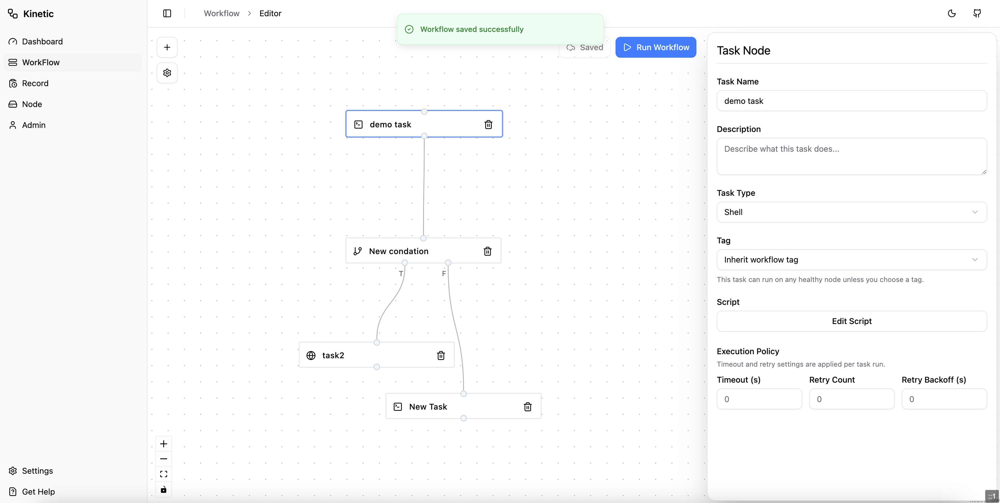

# Kinetic

[](https://github.com/vamosdalian/kinetic/releases)
[](https://github.com/vamosdalian/kinetic/blob/main/LICENSE)
[](https://go.dev/)
[](https://github.com/vamosdalian/kinetic/issues)
[](https://github.com/vamosdalian/kinetic/stargazers)

Kinetic is a lightweight workflow orchestration system with a built-in web UI, HTTP API, scheduler, and distributed worker model. It is designed to be easy to deploy for small teams while still supporting controller/worker separation when you need to run tasks on remote nodes.



## Features

- Built-in web UI served by the backend binary
- Workflow graph editing and execution tracking
- Task types for `shell`, `http`, and `condition`
- Controller and worker run modes
- Embedded worker support for single-node deployments
- Distributed execution with node registration, heartbeats, and task streaming
- SQLite-backed persistence
- Real-time workflow run event streaming

## Architecture

Kinetic supports two runtime modes:

- `controller`: runs the API server, scheduler, persistence layer, and optionally an embedded local worker
- `worker`: connects to a controller and executes assigned tasks

For local development or a simple self-hosted install, the default controller mode with an embedded worker is the fastest way to get started. For multi-node execution, run one controller and attach one or more workers.

## Quick Start

### Run From Releases

Download the archive for your platform from [GitHub Releases](https://github.com/vamosdalian/kinetic/releases), extract it, and run the `kinetic` binary.

Controller quick start:

```bash
KINETIC_MODE=controller \
KINETIC_CONTROLLER_EMBEDDED_WORKER_ENABLED=true \
./kinetic
```

This starts the controller, scheduler, web UI, and an embedded local worker in a single process.

Then open:

- UI: [http://localhost:9898](http://localhost:9898)
- Health check: [http://localhost:9898/healthz](http://localhost:9898/healthz)
- Readiness check: [http://localhost:9898/readyz](http://localhost:9898/readyz)

Worker quick start:

```bash
KINETIC_MODE=worker \
KINETIC_WORKER_CONTROLLER_URL=http://controller-host:9898 \
./kinetic
```

On first start, Kinetic creates a default config file at `~/.kinetic/config.yml` and a SQLite database at `~/.kinetic/kinetic.db`.

## Development

### Prerequisites

- Go `1.23+`
- Node.js `22+`
- npm

### Build and Run Locally

```bash
cd web
npm ci
npm run build
cd ..
KINETIC_MODE=controller \
KINETIC_CONTROLLER_EMBEDDED_WORKER_ENABLED=true \
go run ./cmd/kinetic
```

### Build a Binary

```bash
cd web
npm ci
npm run build
cd ..
go build -o kinetic ./cmd/kinetic
KINETIC_MODE=controller \
KINETIC_CONTROLLER_EMBEDDED_WORKER_ENABLED=true \
./kinetic
```

## Deployment Modes

### Single Node

Run one controller with the embedded worker enabled:

```bash
KINETIC_MODE=controller \
KINETIC_CONTROLLER_EMBEDDED_WORKER_ENABLED=true \
./kinetic
```

### Distributed

Run a controller without the embedded worker:

```bash
KINETIC_MODE=controller \
KINETIC_CONTROLLER_EMBEDDED_WORKER_ENABLED=false \
./kinetic
```

Run a worker that connects to the controller:

```bash
KINETIC_MODE=worker \
KINETIC_WORKER_CONTROLLER_URL=http://controller-host:9898 \
./kinetic
```

## Configuration

Kinetic loads configuration from `~/.kinetic/config.yml` by default, falling back to the legacy `~/.kinetic/config.yaml` if present. You can also specify a custom config file with `-c /path/to/config.yml`.

Configuration priority is:

1. `config.yml`
2. environment variables
3. CLI flags

Example configuration:

```yaml
mode: controller

api:
  host: 0.0.0.0
  port: 9898

database:
  type: sqlite
  path: /home/your-user/.kinetic/kinetic.db

controller:
  embedded_worker_enabled: true
  scheduler_interval: 5
  admin_username: admin
  admin_password: change-me
  auth_secret: replace-with-a-long-random-secret

worker:
  id: node-local
  name: node-local
  controller_url: http://localhost:9898
  advertise_ip: ""
  heartbeat_interval: 5
  stream_reconnect_interval: 5
  max_concurrency: 10

log:
  level: info
  format: text
```

Common environment variable overrides:

- `KINETIC_MODE`
- `KINETIC_API_HOST`
- `KINETIC_API_PORT`
- `KINETIC_DATABASE_PATH`
- `KINETIC_CONTROLLER_EMBEDDED_WORKER_ENABLED`
- `KINETIC_CONTROLLER_SCHEDULER_INTERVAL`
- `KINETIC_CONTROLLER_ADMIN_USERNAME`
- `KINETIC_CONTROLLER_ADMIN_PASSWORD`
- `KINETIC_CONTROLLER_AUTH_SECRET`
- `KINETIC_WORKER_CONTROLLER_URL`
- `KINETIC_WORKER_MAX_CONCURRENCY`
- `KINETIC_LOG_LEVEL`
- `KINETIC_LOG_FORMAT`

Controller mode requires admin auth to be configured. The UI and business API use bearer token auth, while `/api/internal/*` remains open for worker traffic.

## Workflow Model

Kinetic workflows are stored as graph definitions made up of task nodes and edges.

Supported task types:

- `shell`: run shell scripts on a worker
- `http`: make HTTP requests as workflow steps
- `condition`: branch execution based on an expression

Validation rules include:

- every task must have a valid config
- condition nodes must have exactly one incoming edge
- condition nodes must have exactly two outgoing edges with `true` and `false` handles
- workflow graphs must be acyclic

Workflows and tasks can also carry tags so runs can be routed to matching worker nodes.

### Workflow And Task Config

Workflow-level extensible settings are stored in `workflow.config`.

Current workflow config fields:

- `env`: environment variables inherited by tasks unless overridden

Task-level settings remain inside each task's existing `config` object. Tasks may also define `config.env`.

Workflow scheduling is configured outside `workflow.config` with the top-level fields:

- `enable`: enables or disables the workflow trigger
- `trigger.type`: `manual` or `cron`
- `trigger.expr`: standard 5-field cron expression for `cron` triggers

Scheduling notes:

- cron expressions are evaluated in `UTC`
- v1 does not backfill every missed schedule after controller downtime; it creates at most one catch-up run and advances to the next future window
- `manual` workflows are never auto-scheduled

Environment variable precedence is:

1. system-provided `KINETIC_*` variables
2. `workflow.config.env`
3. `task.config.env`

Current system-provided variables:

- `KINETIC_WORKFLOW_NAME`
- `KINETIC_TASK_NAME`
- `KINETIC_RESULT_PATH`

Keys starting with `KINETIC_` are reserved for the system and cannot be defined by users in workflow or task config.

Example:

```json
{
  "name": "Deploy Workflow",
  "config": {
    "env": {
      "API_BASE_URL": "https://api.example.com"
    }
  },
  "taskNodes": [
    {
      "id": "task-1",
      "name": "Run Shell",
      "type": "shell",
      "config": {
        "script": "printf '%s\\n' \"$API_BASE_URL\"",
        "env": {
          "API_BASE_URL": "https://staging-api.example.com"
        }
      }
    }
  ]
}
```

In this example, the shell task receives `API_BASE_URL=https://staging-api.example.com`.

Shell tasks also receive `KINETIC_RESULT_PATH`, which points to `~/.kinetic/results/[runid]/[taskid]_result.json` on the machine that executes the task. If the script writes valid JSON to that file, Kinetic stores it in `task_runs.result` and exposes it from the workflow run detail API. Invalid JSON causes the task to fail.

At the moment, shell tasks receive environment variables directly at runtime. Other supported task types can still reference templated values in their config where applicable.

## Release

GitHub Releases are built from tagged commits. Release assets are attached automatically, and GitHub generates the release notes and changelog sections.
