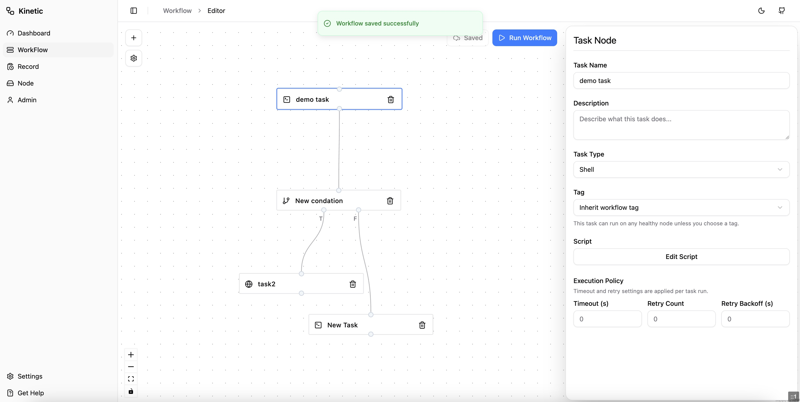

# Kinetic

[](https://github.com/vamosdalian/kinetic/releases)
[](https://github.com/vamosdalian/kinetic/blob/main/LICENSE)
[](https://go.dev/)
[](https://github.com/vamosdalian/kinetic/issues)
[](https://github.com/vamosdalian/kinetic/stargazers)

Kinetic is a lightweight workflow orchestration system with a built-in web UI, HTTP API, scheduler, and distributed worker model. It is designed to be easy to deploy for small teams while still supporting controller/worker separation when you need to run tasks on remote nodes.



## Features

- Built-in web UI served by the backend binary
- Workflow graph editing and execution tracking
- Task types for `shell`, `http`, and `condition`
- Controller and worker run modes
- Embedded worker support for single-node deployments
- Distributed execution with node registration, heartbeats, and task streaming
- SQLite-backed persistence
- Real-time workflow run event streaming

## Architecture

Kinetic supports two runtime modes:

- `controller`: runs the API server, scheduler, persistence layer, and optionally an embedded local worker
- `worker`: connects to a controller and executes assigned tasks

For local development or a simple self-hosted install, the default controller mode with an embedded worker is the fastest way to get started. For multi-node execution, run one controller and attach one or more workers.

## Quick Start

### Install (Linux)

Run the one-liner to download the latest release, install the binary, and register a systemd service that starts on boot:

```bash
curl -sSL https://raw.githubusercontent.com/vamosdalian/kinetic/master/install.sh | bash
```

The service runs as the current user. On first start, Kinetic writes a default config to `~/.kinetic/config.yml` and a SQLite database to `~/.kinetic/kinetic.db`.

```
Status  : systemctl status kinetic
Logs    : journalctl -u kinetic -f
Web UI  : http://<host>:9898   (default credentials: kinetic / kinetic)
```

To install a worker node instead:

```bash
curl -sSL https://raw.githubusercontent.com/vamosdalian/kinetic/master/install.sh | bash -s -- \
  --mode worker \
  --controller-url http://<controller-host>:9898
```

To pin a specific version:

```bash
curl -sSL https://raw.githubusercontent.com/vamosdalian/kinetic/master/install.sh | bash -s -- --version v1.0.0
```

### Run Manually

Download the archive for your platform from [GitHub Releases](https://github.com/vamosdalian/kinetic/releases), extract it, and run the binary directly:

```bash
./kinetic
```

This starts the controller with an embedded worker. On first start the config file is created automatically.

Then open:

- UI: [http://localhost:9898](http://localhost:9898)
- Health check: [http://localhost:9898/healthz](http://localhost:9898/healthz)
- Readiness check: [http://localhost:9898/readyz](http://localhost:9898/readyz)

To run as a worker:

```bash
KINETIC_MODE=worker \
KINETIC_WORKER_CONTROLLER_URL=http://controller-host:9898 \
./kinetic
```

## Development

### Prerequisites

- Go `1.23+`
- Node.js `22+`
- npm

### Build and Run Locally

```bash
cd web
npm ci
npm run build
cd ..
KINETIC_MODE=controller \
KINETIC_CONTROLLER_EMBEDDED_WORKER_ENABLED=true \
go run ./cmd/kinetic
```

### Build a Binary

```bash
cd web
npm ci
npm run build
cd ..
go build -o kinetic ./cmd/kinetic
KINETIC_MODE=controller \
KINETIC_CONTROLLER_EMBEDDED_WORKER_ENABLED=true \
./kinetic
```

## Deployment Modes

### Single Node

Run one controller with the embedded worker enabled:

```bash
KINETIC_MODE=controller \
KINETIC_CONTROLLER_EMBEDDED_WORKER_ENABLED=true \
./kinetic
```

### Distributed

Run a controller without the embedded worker:

```bash
KINETIC_MODE=controller \
KINETIC_CONTROLLER_EMBEDDED_WORKER_ENABLED=false \
./kinetic
```

Run a worker that connects to the controller:

```bash
KINETIC_MODE=worker \
KINETIC_WORKER_CONTROLLER_URL=http://controller-host:9898 \
./kinetic
```

## Workflow Model

Kinetic workflows are stored as graph definitions made up of task nodes and edges.

Supported task types:

- `shell`: run shell scripts on a worker
- `http`: make HTTP requests as workflow steps
- `condition`: branch execution based on an expression

Validation rules include:

- every task must have a valid config
- condition nodes must have exactly one incoming edge
- condition nodes must have exactly two outgoing edges with `true` and `false` handles
- workflow graphs must be acyclic

Workflows and tasks can also carry tags so runs can be routed to matching worker nodes.

### Workflow And Task Config

Workflow-level extensible settings are stored in `workflow.config`.

Current workflow config fields:

- `env`: environment variables inherited by tasks unless overridden

Task-level settings remain inside each task's existing `config` object. Tasks may also define `config.env`.

Tasks also have a `ref` field. The `ref` is a stable template key and must be unique within the workflow. Task names are display labels and may be duplicated; templates should use refs for upstream task output.

Workflow scheduling is configured outside `workflow.config` with the top-level fields:

- `enable`: enables or disables the workflow trigger
- `trigger.type`: `manual` or `cron`
- `trigger.expr`: standard 5-field cron expression for `cron` triggers

Scheduling notes:

- cron expressions are evaluated in `UTC`
- v1 does not backfill every missed schedule after controller downtime; it creates at most one catch-up run and advances to the next future window
- `manual` workflows are never auto-scheduled

Environment variable precedence is:

1. system-provided `KINETIC_*` variables
2. `workflow.config.env`
3. `task.config.env`

Current system-provided variables:

- `KINETIC_WORKFLOW_NAME`
- `KINETIC_TASK_NAME`
- `KINETIC_RESULT_PATH`

Keys starting with `KINETIC_` are reserved for the system and cannot be defined by users in workflow or task config.

Example:

```json
{
  "name": "Deploy Workflow",
  "config": {
    "env": {
      "API_BASE_URL": "https://api.example.com"
    }
  },
  "taskNodes": [
    {
      "id": "task-1",
      "ref": "run_shell",
      "name": "Run Shell",
      "type": "shell",
      "config": {
        "script": "printf '%s\\n' \"$API_BASE_URL\"",
        "env": {
          "API_BASE_URL": "https://staging-api.example.com"
        }
      }
    }
  ]
}
```

In this example, the shell task receives `API_BASE_URL=https://staging-api.example.com`.

Shell tasks also receive `KINETIC_RESULT_PATH`, which points to `~/.kinetic/results/[workflow_run_id]/[task_run_id]_result.json` on the machine that executes the task. If the script writes JSON to that file, Kinetic stores it in `task_runs.result` and exposes it from the workflow run detail API. Downstream templates can read parsed JSON fields through the upstream task ref, such as `${{ .upstream.run_shell.result.version }}`.

At the moment, shell tasks receive environment variables directly at runtime. Other supported task types can still reference templated values in their config where applicable.

## Release

GitHub Releases are built from tagged commits. Release assets are attached automatically, and GitHub generates the release notes and changelog sections.
